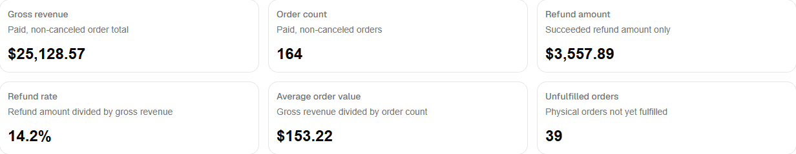
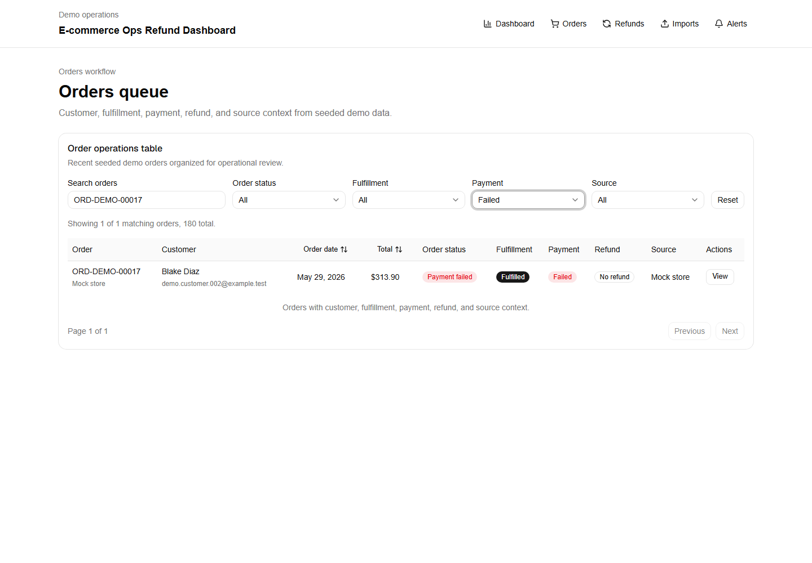
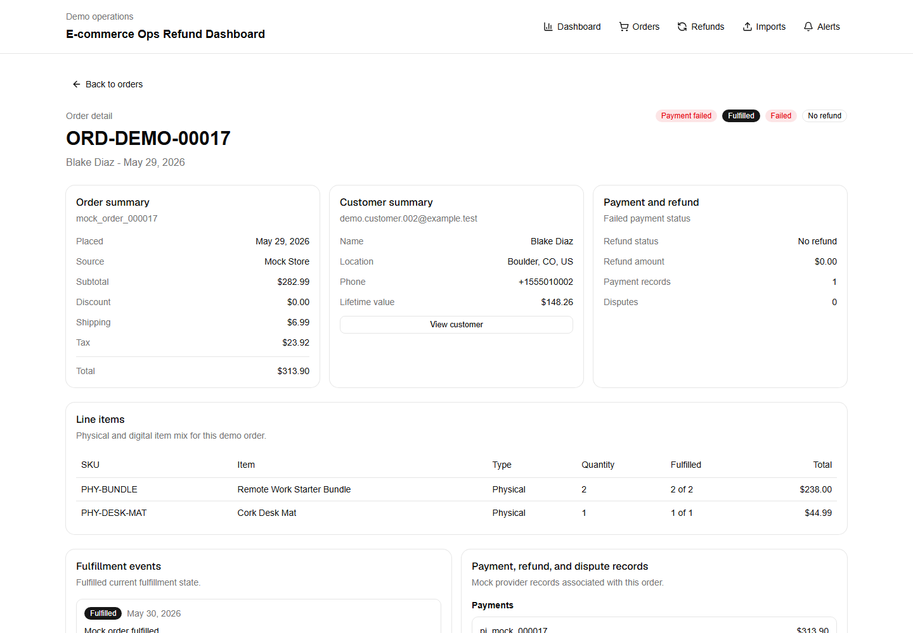
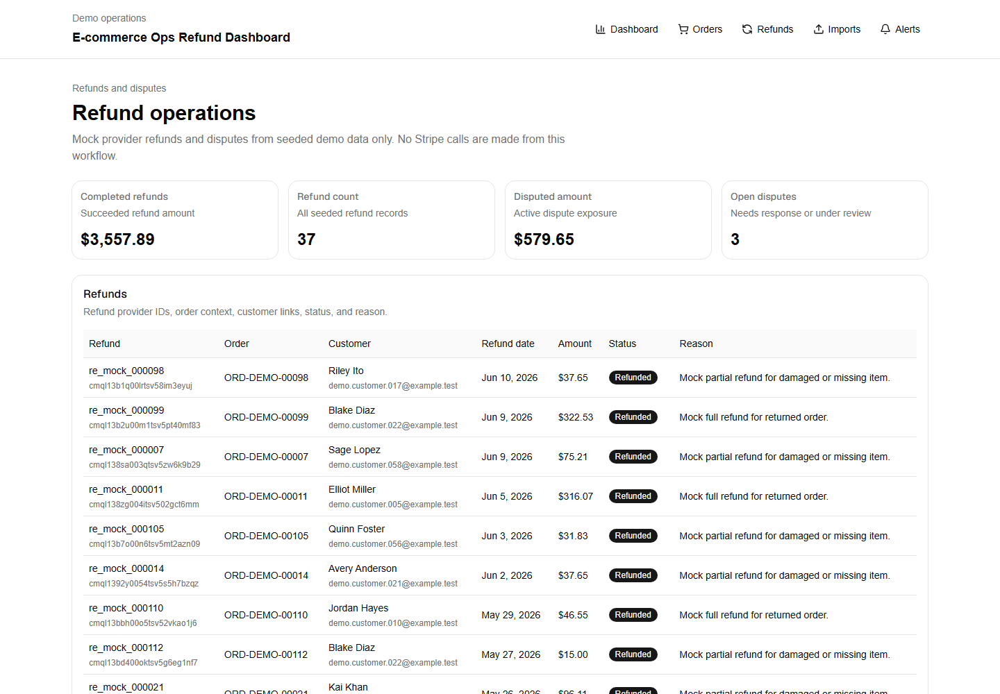
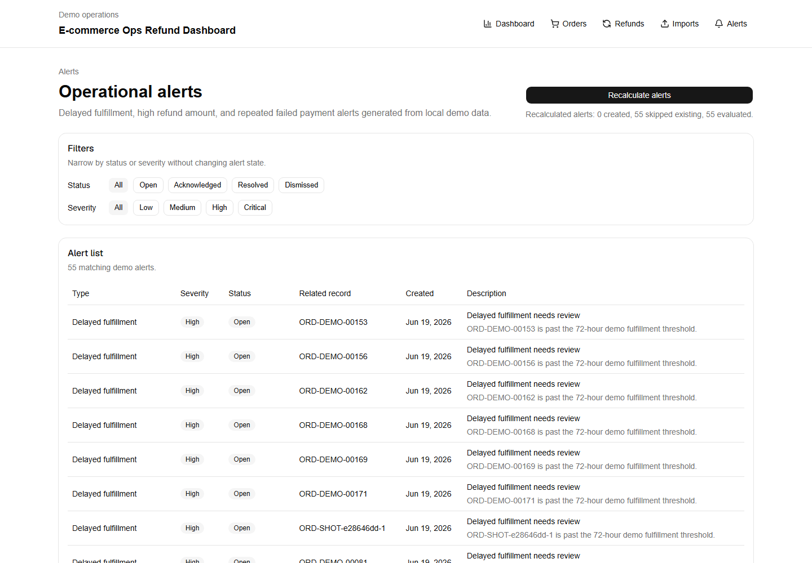
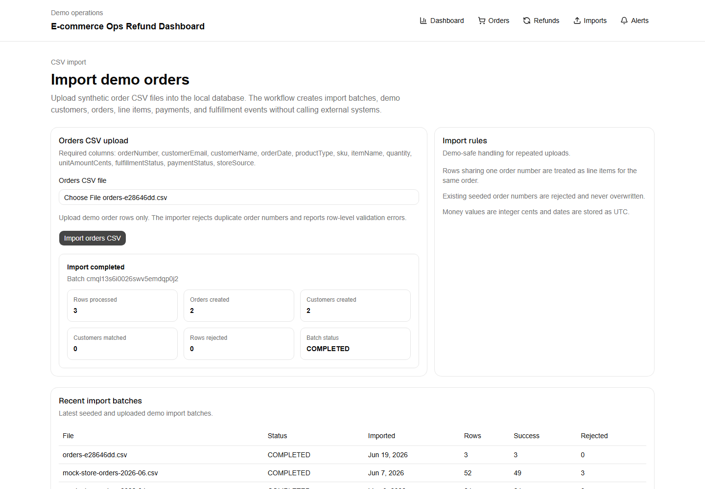

# E-commerce Operations & Refund Dashboard

## 60-second client read

This is a client-style portfolio demo for a small e-commerce operations dashboard: orders, revenue, refunds, disputes, fulfillment status, alerts, CSV import/export, and Stripe-style test webhook handling in one local admin interface.

**Best-fit client problem:** a store owner or operations team tracks orders, refunds, disputes, failed payments, and fulfillment issues across disconnected exports and dashboards, making exceptions easy to miss.

**Business value demonstrated:** clearer weekly operations review, faster refund/dispute visibility, searchable order context, delayed-fulfillment alerts, and exportable reports for manual review or team handoff.

**Technical proof:** Next.js, TypeScript, PostgreSQL, Prisma, seeded synthetic data, dashboard KPIs, order/detail pages, refund/dispute pages, CSV import/export, mock/test-only Stripe-style webhooks, Vitest, Playwright, and GitHub Actions.

**Demo safety:** all customer, order, payment, refund, and dispute data is synthetic. The project does not use real Stripe, Shopify, WooCommerce, or customer data.

## What a real client version would connect

- Shopify, WooCommerce, Stripe, or CSV exports from the client's existing tools
- Client-specific alert rules for delayed fulfillment, refund thresholds, failed payments, or repeated disputes
- Role-based access if used by a team
- Scheduled weekly reports or dashboard snapshots
- Deployment to a client-owned Vercel, Supabase, Render, Railway, or similar account

## Screenshots

All screenshots below were captured from the local app using seeded synthetic demo data only.

| KPI overview | Orders table |
| --- | --- |
|  |  |

| Order detail | Refunds and disputes |
| --- | --- |
|  |  |

| Alert list | CSV workflow |
| --- | --- |
|  |  |

## Demo video

The repository includes a repeatable Playwright capture workflow for a silent business demo:

```powershell
docker compose up -d db
pnpm db:generate
pnpm db:seed
pnpm media:demo
```

The capture opens the dashboard, reviews KPI summary, filters the orders queue for an exception, opens an order detail page, reviews refund/dispute context, imports a synthetic CSV, recalculates alerts, downloads the weekly CSV export, and ends on the mock/test-only payment safety note. It writes the video to `docs/demo/ecommerce-ops-refund-dashboard-demo.webm`.

The video file is linked here only after it exists in the repository; until then, use `pnpm media:demo` to generate it locally.

## How this adapts to Shopify, WooCommerce, or Stripe-only businesses

- **Shopify-based stores:** sync orders, customers, fulfillment states, refunds, and returns from Shopify, then keep the dashboard focused on delayed fulfillment, refund exposure, and weekly operations review.
- **WooCommerce-based stores:** pull order, customer, refund, and payment-gateway metadata from WooCommerce while preserving the same queue, alert, and export workflows.
- **Stripe-only or payment-provider-led workflows:** treat Stripe-style events as the source for payments, failed charges, refunds, and disputes, then enrich them with order metadata from CSV or a lightweight internal source.
- **CSV-export-heavy teams:** keep CSV import/export as the operating bridge, with validation, exception alerts, and weekly reports layered over the files the team already uses.

## Demo safety and payment boundaries

- Webhooks and payment flows are mock/test-only in this portfolio demo.
- No real payment credentials are required for local setup, screenshots, or automated tests.
- The app does not make live Stripe API calls; the Stripe SDK is used for local webhook signature verification only.
- Seeded customer, order, payment, refund, dispute, alert, import, and webhook records are deterministic synthetic data.
- Do not use real Stripe, Shopify, WooCommerce, customer, order, payment, refund, or dispute data with this repository.
- `.env.local` stays untracked. `.env.example` contains safe placeholders only.

## Data model overview

| Entity | What it represents in the demo |
| --- | --- |
| `Customer` | Synthetic customer identity, location, lifetime value, notes, orders, payments, and alerts. |
| `Order` | Store order with source, status, fulfillment status, monetary totals, customer link, items, payments, refunds, disputes, alerts, and optional import batch. |
| `OrderItem` | Line items on an order, including SKU, product type, quantity, amount, and fulfillment quantity. |
| `Payment` | Mock provider payment records tied to customers and orders, including status, amount, failure details, refunds, disputes, webhook events, and alerts. |
| `Refund` | Mock refund records tied to orders and optional payments, with provider IDs, status, amount, reason, and webhook event links. |
| `Dispute` | Mock dispute records tied to orders and optional payments, with provider IDs, status, amount, reason, and webhook event links. |
| `FulfillmentEvent` | Fulfillment timeline records for orders, including status, date, carrier, tracking number, and notes. |
| `AlertRule` / `Alert` | Demo alert configuration and generated operational exceptions for delayed fulfillment, high refund amount, and repeated failed payments. |
| `CustomerNote` | Local-only operations notes for synthetic customers and optional related orders. |
| `ImportBatch` | CSV import batches with source, status, file name, row counts, success/failure counts, notes, and imported orders. |
| `WebhookEvent` | Stored mock/test webhook payloads with provider event ID, processing status, raw JSON payload, and optional links to payments, refunds, disputes, or import batches. |

## Current implemented scope

- Prisma data model for customers, orders, order items, payments, refunds, disputes, fulfillment events, alert rules, alerts, customer notes, import batches, and webhook events.
- Deterministic fake seed data for a credible operations dataset.
- Mock Stripe-style webhook fixtures and mock-first store adapter contracts.
- Pure KPI/domain calculations for revenue, order count, refund amount, refund rate, average order value, unfulfilled orders, delayed fulfillment, failed payments, and active dispute exposure.
- Prisma-backed dashboard overview at `/` with KPI cards and a weekly revenue/refund chart.
- Prisma-backed orders workflow at `/orders` with client-side search, filters, sorting, pagination, status badges, and detail links.
- Order detail route at `/orders/[orderId]` with order, customer, line item, payment, refund, dispute, and fulfillment context.
- Refunds and disputes route at `/refunds` backed by seeded mock provider records.
- Customer detail route at `/customers/[customerId]` with orders, refunds, disputes, notes, and a demo-safe note form.
- CSV order import workflow at `/imports` and `POST /api/imports/orders`.
- Weekly operations CSV export at `GET /api/reports/weekly-ops?weekStart=YYYY-MM-DD`.
- Alert list and recalculation workflow at `/alerts` and `POST /api/alerts/recalculate`.
- Mock/test-only Stripe webhook endpoint at `POST /api/webhooks/stripe` with local signature verification, idempotent event storage, and safe mapping for refund, failed-payment, and dispute test events.
- Automated Vitest coverage for domain calculations, CSV validation/escaping, alert evaluation, order helpers, and import/alert service flows.
- Playwright Chromium coverage for the main dashboard, orders flow, import workflow, alert recalculation, and weekly CSV download.
- GitHub Actions CI for lint, typecheck, Vitest, build, and Playwright Chromium against seeded PostgreSQL.

This repository is not production-ready. It intentionally does not implement real production Stripe API calls, real Shopify/WooCommerce adapters, auth, production deployment, or live payment data workflows.

## Tech stack

- Next.js App Router with TypeScript
- React 19
- Tailwind CSS v4
- shadcn/ui using the Radix Nova preset and Lucide icons
- Recharts for the overview chart
- TanStack Table for the orders table
- Next.js Route Handlers for imports, exports, alert recalculation, and mock/test Stripe webhooks
- Stripe SDK for local webhook signature verification only
- Prisma 7 with local PostgreSQL through Docker Compose
- Vitest, Testing Library, and jsdom for unit tests
- Playwright Chromium for browser/E2E tests and media capture
- pnpm as the only project package manager

## Setup

Run commands from the project root:

```powershell
Set-Location -LiteralPath "C:\Users\alex\Documents\Coding Projects\Portfolio Projects\ecommerce-ops-refund-dashboard"
corepack enable
pnpm install
Copy-Item .env.example .env.local
```

Keep `.env.local` local-only and do not commit real secrets.

## Database, migrations, and seed data

The local database service is named `db` and maps container port `5432` to host port `5433`.

```powershell
docker compose up -d db
pnpm db:generate
pnpm db:seed
```

If seed fails because migrations have not been applied:

```powershell
pnpm db:migrate
pnpm db:seed
```

The seed uses fixed reference date `2026-06-15T12:00:00.000Z` and a fixed pseudo-random seed. It creates 85 customers, 180 orders, 420 order items, 174 payments, 37 refunds, 7 disputes, 244 fulfillment events, 3 alert rules, 33 alerts, 30 customer notes, 3 import batches, and 219 webhook events.

Useful database scripts:

```powershell
pnpm db:generate
pnpm db:migrate
pnpm db:seed
pnpm db:studio
pnpm db:reset
```

## Run the dashboard locally

Start the database and seed it first, then run:

```powershell
pnpm dev
```

Open:

- `http://localhost:3000`
- `http://localhost:3000/orders`
- `http://localhost:3000/refunds`
- `http://localhost:3000/imports`
- `http://localhost:3000/alerts`

## Business workflows

### KPI formulas

- Gross revenue: paid non-canceled order total.
- Order count: paid non-canceled orders.
- Refund amount: succeeded/completed refund amount only.
- Refund rate: refund amount divided by gross revenue; zero when gross revenue is zero.
- Average order value: gross revenue divided by paid non-canceled order count.
- Unfulfilled orders: physical orders that are not fulfilled and not canceled.
- Delayed fulfillment: unfulfilled physical orders older than the configured delay threshold.
- Failed payment count: failed payments.
- Disputed amount: active dispute exposure; closed, won, and lost disputes are excluded.

### Orders, refunds, customers, and alerts

The `/orders` route demonstrates an internal operations queue for reviewing order health across customer identity, source, fulfillment state, payment status, refund exposure, and order value. The detail route shows the context an operations user would need before escalating a delayed fulfillment, payment failure, refund, or dispute.

The `/refunds` route shows completed refund amount, refund count, disputed amount, open disputes, a refunds table, and a disputes table using seeded local database records only.

The `/customers/[customerId]` route shows a synthetic customer profile, lifetime revenue/refund metrics, customer orders, refunds, disputes, seeded notes, and a local-only note form. Notes are validated with Zod and saved to the local database as `Ops demo agent`.

The `/alerts` route lists generated alerts and can recalculate them. Seeded alert rules drive thresholds:

- Delayed fulfillment: physical unfulfilled orders older than 72 hours.
- High refund amount: succeeded refunds at or above 10,000 cents.
- Repeated failed payments: customers with at least 2 failed mock payments.

Alert generation is idempotent by matching the rule and related order, refund, or customer before creating a new alert.

### CSV import and weekly export

The `/imports` route uploads order CSV files to `POST /api/imports/orders`. Required columns:

```text
orderNumber, customerEmail, customerName, orderDate, productType, sku, itemName, quantity, unitAmountCents, fulfillmentStatus, paymentStatus, storeSource
```

CSV rows are item rows. Multiple rows can share one `orderNumber` to create one order with multiple line items, but existing order numbers are rejected and never overwritten. Valid imports create demo customers, orders, order items, mock payments, fulfillment events, and an import batch summary. Invalid rows return row-level errors.

`orderDate` must be a real calendar date in `YYYY-MM-DD` or ISO format. Impossible dates such as `2026-02-31` are rejected instead of being rolled forward by JavaScript date parsing.

Sample fixtures:

- `tests/fixtures/orders-import-sample.csv`
- `tests/fixtures/orders-import-invalid.csv`

The weekly operations export is available from the dashboard button or directly. `weekStart` must be a real `YYYY-MM-DD` calendar date:

```powershell
Invoke-WebRequest "http://localhost:3000/api/reports/weekly-ops?weekStart=2026-06-15" -OutFile weekly-ops-2026-06-15.csv
```

The export returns `text/csv` with rows for orders, refunds, disputes, fulfillment delays, and open alerts. CSV fields are escaped for commas, quotes, and newlines.

To run the import/export flow locally:

```powershell
docker compose up -d db
pnpm db:generate
pnpm db:seed
pnpm dev
```

Open `http://localhost:3000/imports`, upload `tests/fixtures/orders-import-sample.csv`, confirm the imported order appears in `/orders`, open `/alerts` and recalculate alerts, then use the dashboard weekly export button.

## Mock integrations and Stripe test webhooks

Mock Stripe-style event fixtures live under `src/lib/test-data/stripe-events/` and contain fake `evt_mock_`, `pi_mock_`, `re_mock_`, and `dp_mock_` identifiers only. The mock store adapter under `src/lib/store-adapters/` defines the contract future Shopify, WooCommerce, Stripe-only, or CSV adapters can implement without adding real network calls or credentials.

`POST /api/webhooks/stripe` accepts signed Stripe-format webhook payloads in mock/test mode only. The route reads the raw request body, requires `STRIPE_WEBHOOK_SECRET`, verifies the `stripe-signature` header locally with the Stripe SDK, and never calls Stripe APIs.

Supported test event mappings:

- `charge.refunded`: stores the webhook, matches the payment intent to a local mock payment when possible, upserts a refund by provider refund ID, updates refund/payment/order status, and recalculates alerts.
- `payment_intent.payment_failed`: stores the webhook, matches the payment intent to a local mock payment when possible, marks the payment/order failed, and recalculates alerts.
- `charge.dispute.created`: stores the webhook, matches the payment intent to a local mock payment when possible, upserts a dispute by provider dispute ID, and marks the payment/order disputed.

Idempotency uses the existing `WebhookEvent.providerEventId` unique key. A repeated valid delivery of the same Stripe event returns `duplicate: true` and skips duplicate refund, dispute, or payment writes. Unknown valid event types are stored safely and marked ignored.

Local automated tests use `whsec_mock_test_secret` only inside test setup. They generate deterministic signed requests with Stripe's local test-header helper and do not require Stripe CLI, Stripe login, real credentials, or network calls.

Optional Stripe CLI test-mode commands were not run by Codex. Run them manually only with Stripe test mode and explicit local approval:

```powershell
stripe login
stripe listen --forward-to localhost:3000/api/webhooks/stripe
stripe trigger charge.refunded
stripe trigger payment_intent.payment_failed
stripe trigger charge.dispute.created
```

## Build and production preview

Build:

```powershell
pnpm build
```

Build first, then start the Next.js production server:

```powershell
pnpm build
pnpm exec next start -p 3000 -H 127.0.0.1
```

Open `http://127.0.0.1:3000`. Stop the server with `Ctrl+C`.

Use production preview for portfolio screenshots so the Next.js dev indicator is not visible.

## Tests, validation, and CI

Run individual gates:

```powershell
pnpm lint
pnpm typecheck
pnpm test
pnpm build
pnpm e2e -- --project=chromium
```

Run the aggregate non-browser gate:

```powershell
pnpm validate
```

`pnpm validate` runs lint, typecheck, unit tests, and build. E2E is separate because Playwright starts or reuses a local server and controls Chromium.

GitHub Actions in `.github/workflows/ci.yml` runs on push and pull request. It starts PostgreSQL, installs dependencies, generates the Prisma client, applies migrations, seeds demo data, then runs lint, typecheck, Vitest, build, installs Playwright Chromium, and runs E2E.

## Manual QA and media docs

- Manual QA checklist: `docs/RUNBOOK.md`
- Screenshot checklist: `docs/screenshots-checklist.md`
- Screenshot naming convention: `docs/assets/screenshots/README.md`
- Demo video script: `docs/demo-video-script.md`
- Demo recording checklist: `docs/demo-recording-checklist.md`
- Phase history and validation record: `docs/STATE.md`
